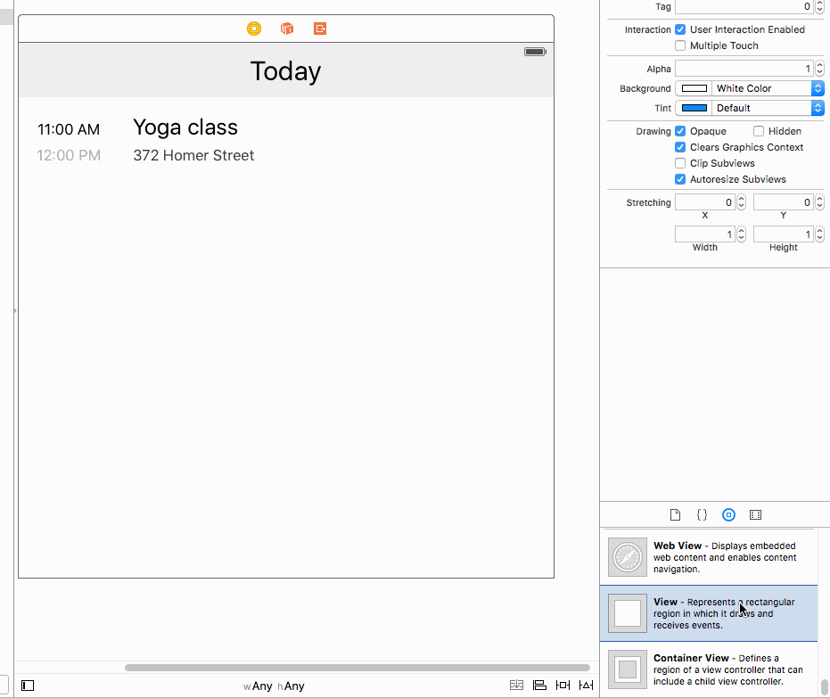

# Hail an Uber for your App Users in under 20 Lines of Code

We all know that the key to building a loyal following for your app is to delight your users. Help a forgetful boyfriend make an OpenTable reservation for the big anniversary, or save someone from arriving late by hailing them an Uber — they’ll never forget your app!

[Button](http://www.usebutton.com) provides a simple SDK for iOS and Android that lets your users transact with Ticketmaster, Uber, OpenTable, AirBnb and more — all without leaving your app. Best of all, you get a share of any revenue driven.

Ready to get started?


In this tutorial, we’ll integrate the Uber Commerce Card into your iOS app in 20 lines of code! The future is now. Let's do it!

## 1. Setup Project

### Clone GitHub Repository (Optional)

If you’d like to follow along in a sandbox environment, clone the demo repository from GitHub — we’ll walk you through each step based on this sample calendar app. Or, skip this step and integrate into your own app!

To use the Calendar app, open your Terminal, and type:

     git clone https://github.com/stewartyu/calendar-app.git

This will clone the repository to your computer as a starting point.

### Install CocoaPods

If you don’t already have it, you’ll need CocoaPods — it’s the best way to manage library dependencies for iOS.

In your Terminal, type:

     [sudo] gem install cocoapods

If you have any issues installing CocoaPods, take a look at this [troubleshooting guide](https://guides.cocoapods.org/using/troubleshooting#installing-cocoapods).

### Install Button SDK

Open `Podfile` in a text editor and add `Button` as a dependency.

```
    platform :ios, '8.0'
    use_frameworks!

    target 'SwiftPodsExample' do
       pod 'Button', '~> 4'
    end
```

In your Terminal, navigate to the Calendar directory, then type:

     pod install

This will download the Button SDK to your project.

Once that’s done, you’ll find a new file called `Calendar.xcworkspace` — open it up in Xcode and build it!

### Update Info.plist

Button’s power comes from integrating with apps that your users already have installed — in this case, their Uber app. The heavy lifting has already been done by Uber, so they’re already signed in, have their preferences and payment methods stored, ready to be used in your app!

To let your app query if other apps are installed, iOS9 requires you to declare the scheme in your `Info.plist` file.

Open the `button_schemes.plist` in Xcode and copy the `LSApplicationQueriesSchemes` key.

[Download button_schemes.plist](https://www.usebutton.com/res/button_schemes.plist)

Then, open `Calendar/Info.plist` and paste in the `LSApplicationQueriesSchemes`.


Awesome! With the setup complete, let's get on with the integration.

## 2. Configure Your Button

Next, let’s set up the Uber integration in your Button Dashboard. Don’t have an account? [Create one for free at app.usebutton.com](http://app.usebutton.com)!

In the Button dashboard, click the **Add a Button** link in the sidebar to create a new Button for your app.


Under **Name your Button**, give a name like "Calendar View Uber Button":


Under **Select an App**, choose the app for this integration. If you don’t have one, click **Add a new app** to create a new one.


Under **Select a use case**, choose **Uber**. Then, scroll to the bottom of the page and click **Add Button**.


Great! You’ve finished configuring your Button. Take note of your Button ID and Application ID — you'll need it for this final step of adding the Button to your app!

## 3. Add the Button to your App

### Configure your Application ID

Open `Calendar/AppDelegate.swift` in Xcode to configure your Application ID.

First, you’ll have to import the Button library. At the top of the file, add:

     import Button

Next, in the `application` function, allow Button to request location permissions, and configure Button with your Application ID:

      Button.allowButtonToRequestLocationPermission(true)

      Button.sharedButton().configureWithApplicationId(“YOUR-APPLICATION-ID") { (configError: NSError?) -> Void in
            if let error = configError {
                print("Error: \(error.localizedDescription)")
            }
        }

Make sure to change `YOUR-APPLICATION-ID` to the one you received in the Button dashboard.

### Add Uber to the Calendar View

We’re ready to add the Button to your app now!

Open `Main.storyboard`. Drag and drop a new `UIView` into the storyboard and adjust the bounds to your liking (we recommend around 180x40).



Next, change the UIView’s class to `BTNDropinButton` and set the **Button Id** to the Button ID from the Button Dashboard.


Now, link up your new Button to your application code. First, Enable Assistant Editor mode, by selecting **View > Assistant Editor > Show Assistant Editor**. Then, Control+Click the Button UIView and drag it to your application code for `Calendar/ViewController.swift`.

In the popup, give your button a name like "dropinButton". You'll use this variable name in your application code.


In `Calendar/ViewController.swift`, you’ll have to import the Button library. At the top of the file, add:

     import Button

Next, add the following code to the `viewDidLoad` function to set the context for your Uber button. You can set the location to be the user's destination, but for now we'll hardcode this location.

      let location: BTNLocation = BTNLocation.init(name: "Yoga", latitude: 40.723027, longitude: -73.9956459);
      let context: BTNContext = BTNContext.init(subjectLocation: location);

      if let button = self.dropinButton {
          button.prepareWithContext(context, completion: { (isDisplayable: Bool) -> Void in
              print("Displayable: \(isDisplayable)")
          })
      }

That's it! Run your project and now, your users can get a few minutes of meditation in their Uber on their way to yoga class!


*****
